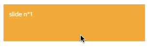
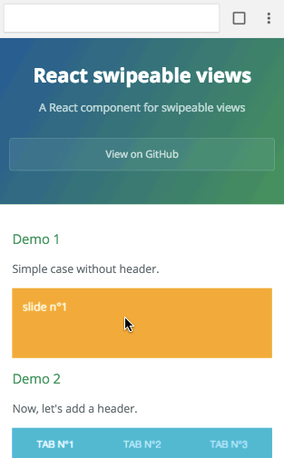
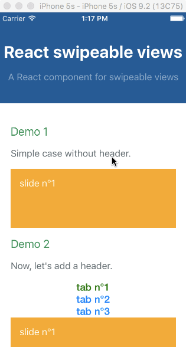
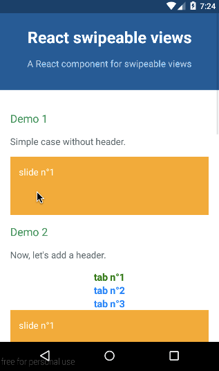

# react-swipeable-views

> 一个轮播组件

[](https://www.npmjs.com/package/react-swipeable-views)
[](https://www.npmjs.com/package/react-swipeable-views)
[](https://travis-ci.org/oliviertassinari/react-swipeable-views)

[](https://david-dm.org/oliviertassinari/react-swipeable-views)
[](https://david-dm.org/oliviertassinari/react-swipeable-views#info=devDependencies&view=list)
[](https://www.paypal.me/oliviertassinari/10)
[](http://definitelytyped.org)

## 安装

### 浏览器版

```sh
npm install --save react-swipeable-views
```

### Native

```sh
npm install --save react-swipeable-views-native
```

<a target='_blank' rel='nofollow' href='https://app.codesponsor.io/link/exeebWrRmXisY5kkhcJd58AS/oliviertassinari/react-swipeable-views'></a>

## 这个问题解决了

查看([demos](http://oliviertassinari.github.io/react-swipeable-views/)从一个移动设备(真实或模拟)。
它很小(<4kB)，它快速呈现第一张幻灯片，然后延迟加载其他的

## 简单的示例


### Browser

```jsx
import React from 'react';
import SwipeableViews from 'react-swipeable-views';

const styles = {
  slide: {
    padding: 15,
    minHeight: 100,
    color: '#fff',
  },
  slide1: {
    background: '#FEA900',
  },
  slide2: {
    background: '#B3DC4A',
  },
  slide3: {
    background: '#6AC0FF',
  },
};

const MyComponent = () => (
  <SwipeableViews>
    <div style={Object.assign({}, styles.slide, styles.slide1)}>
      slide n°1
    </div>
    <div style={Object.assign({}, styles.slide, styles.slide2)}>
      slide n°2
    </div>
    <div style={Object.assign({}, styles.slide, styles.slide3)}>
      slide n°3
    </div>
  </SwipeableViews>
);

export default MyComponent;
```

### Native

```jsx
import React from 'react';
import {
  StyleSheet,
  Text,
  View,
} from 'react-native';

import SwipeableViews from 'react-swipeable-views-native';
// There is another version using the scroll component instead of animated.
// I'm unsure which one give the best UX. Please give us some feedback.
// import SwipeableViews from 'react-swipeable-views-native/lib/SwipeableViews.scroll';

const styles = StyleSheet.create({
  slideContainer: {
    height: 100,
  },
  slide: {
    padding: 15,
    height: 100,
  },
  slide1: {
    backgroundColor: '#FEA900',
  },
  slide2: {
    backgroundColor: '#B3DC4A',
  },
  slide3: {
    backgroundColor: '#6AC0FF',
  },
  text: {
    color: '#fff',
    fontSize: 16,
  },
});

const MyComponent = () => (
  <SwipeableViews style={styles.slideContainer}>
    <View style={[styles.slide, styles.slide1]}>
      <Text style={styles.text}>
        slide n°1
      </Text>
    </View>
    <View style={[styles.slide, styles.slide2]}>
      <Text style={styles.text}>
        slide n°2
      </Text>
    </View>
    <View style={[styles.slide, styles.slide3]}>
      <Text style={styles.text}>
        slide n°3
      </Text>
    </View>
  </SwipeableViews>
);

export default MyComponent;
```

## 平台支持

API在三个平台之间是尽可能一致的，相同的组件可以在不同地方独立使用。

### 浏览器


| IE    | Edge | Windows Phone | Firefox | Chrome | Safari |
|:------|:-----|:--------------|:--------|:-------|:-------|
| >= 10 | ✓    | x             | >= 28   | >= 29  | >= 8   |

### iOS


### Android


## `virtualize`的例子

这个无限特性是由于一个高阶组件提供的。它是独立于目标平台的。
您可以查看一下*Demo 8*，以查看它的实际操作。
这是高度受[react-virtualized](https://github.com/bvaughn/react-virtualized)启发的。
让我们来看一个浏览器的例子:


```jsx
import React from 'react';
import SwipeableViews from 'react-swipeable-views';
import { virtualize } from 'react-swipeable-views-utils';

const VirtualizeSwipeableViews = virtualize(SwipeableViews);

const slideRenderer = ({key, index}) => (
  <div key={key}>
    {`slide n°${index + 1}`}
  </div>
);

const MyComponent = () => (
  <VirtualizeSwipeableViews slideRenderer={slideRenderer} />
);

export default MyComponent;
```

## `autoPlay`自动播放

自动播放特性由高阶组件提供。它是独立于目标平台的。
您可以查看一下*Demo 7*，以查看它的实际操作。
让我们来看一个浏览器的例子:

```jsx
import React from 'react';
import SwipeableViews from 'react-swipeable-views';
import { autoPlay } from 'react-swipeable-views-utils';

const AutoPlaySwipeableViews = autoPlay(SwipeableViews);

const MyComponent = () => (
  <AutoPlaySwipeableViews>
    <div>slide n°1</div>
    <div>slide n°2</div>
    <div>slide n°3</div>
  </AutoPlaySwipeableViews>
);

export default MyComponent;
```

##  `bindKeyboard`绑定键盘

自动播放特性由高阶组件提供。它是独立于目标平台的。
您可以查看一下*Demo 9*，以查看它的实际操作。
让我们来看一个浏览器的例子:

```jsx
import React from 'react';
import SwipeableViews from 'react-swipeable-views';
import { bindKeyboard } from 'react-swipeable-views-utils';

const BindKeyboardSwipeableViews = bindKeyboard(SwipeableViews);

const MyComponent = () => (
  <BindKeyboardSwipeableViews>
    <div>slide n°1</div>
    <div>slide n°2</div>
    <div>slide n°3</div>
  </BindKeyboardSwipeableViews>
);

export default MyComponent;
```
绑定键盘后，可以使用键盘的**左右键**进行控制。

## API

### `<SwipeableViews />`

| 名称 | 类型 | 默认值 | 平台 | 描述 |
|:-----|:-----|:--------|:---------|:------------|
| animateHeight | bool | `false` | browser | If `true`, the height of the container will be animated to match the current slide height. Animating another style property has a negative impact regarding performance. |
| animateTransitions | bool | `true` | all | If `false`, changes to the index prop will not cause an animated transition. |
| axis | enum [`'x'`, `'x-reverse'`, `'y'`, `'y-reverse'`] | `'x'` | browser | The axis on which the slides will slide. |
| children | node | | all | Use this property to provide your slides. |
| containerStyle | object | `{}` | all | Whether or not the auto complete is animated as it is toggled. |
| disabled | bool | `false` | all | If `true`, it will disable touch events. This is useful when you want to prohibit the user from changing slides. |
| disableLazyLoading | bool | false | browser | This is the config used to disable lazy loading, if `true` it will render all the views in first rendering. |
| enableMouseEvents | bool | `false` | browser | If `true`, it will enable mouse events. This will allow the user to perform the relevant swipe actions with a mouse. |
| hysteresis | float | `0.6` | all | Configure hysteresis between slides. This value determines how far should user swipe to switch slide. |
| ignoreNativeScroll | bool | false | browser | If `true`, it will ignore native scroll container. It can be used to filter out false positive that blocks the swipe. |
| index | integer | `0` | all | This is the index of the slide to show. This is useful when you want to change the default slide shown. Or when you have tabs linked to each slide. |
| onChangeIndex | function(index, indexLatest) | | all | This is callback prop. It's call by the component when the shown slide change after a swipe made by the user. This is useful when you have tabs linked to each slide. |
| onSwitching | function(index, type) | | all | This is callback prop. It's called by the component when the slide switching. This is useful when you want to implement something corresponding to the current slide position. |
| onTransitionEnd | function | | all | The callback that fires when the animation comes to a rest. This is useful to defer CPU intensive task. |
| resistance | bool | `false` | all | If true, it will add bounds effect on the edges. |
| style | object | `{}` | all | This is the inlined style that will be applied on the root component. |
| slideStyle | object | `{}` | all | This is the inlined style that will be applied on the slide component. |
| springConfig | object | `{duration: '0.3s', easeFunction: '...', delay: '0s'}` | browser | This is the config used to create CSS transitions. This is useful to change the dynamic of the transition. |
| springConfig | object | `{tension: 300, friction: 30}` | native.animated | This is the config given to Animated for the `spring`. This is useful to change the dynamic of the transition. |
| threshold | integer | `5` | all | This is the threshold used for detecting a quick swipe. If the computed speed is above this value, the index change. |

Any other properties like `className` will be applied to the root component.

### `virtualize`
这一高阶组件扩展了`<SwipeableViews />`的属性，并添加了以下内容:
| 名称 | 类型 | 默认值 | 平台 | 描述 |
|:-----|:-----|:--------|:---------|:------------|
| overscanSlideAfter | integer | `2` | all | Number of slide to render after the visible slide. |
| overscanSlideBefore | integer | `3` | all | Number of slide to render before the visible slide. Separate from `overscanSlideAfter` as it's more difficult to keep the window up to date.|
| slideCount | integer | | all | When set, it's adding a limit to the number of slide: [0, slideCount]. |
| slideRenderer | func | | all | Responsible for rendering a slide given an index. ({ index: integer }): node |

### `autoPlay`

这一高阶组件扩展了`<SwipeableViews />`的属性，并添加了以下内容:

| 名称 | 类型 | 默认值 | 平台 | 描述 |
|:-----|:-----|:--------|:---------|:------------|
| autoplay | bool | `true` | all | If `false`, the auto play behavior is disabled. |
| direction | enum:<br>&nbsp;'incremental'<br>&nbsp;'decremental' | `'incremental'` | all | This is the auto play direction. |
| interval | integer | `3000` | all | Delay between auto play transitions (in ms). |

### `bindKeyboard`

这一高阶组件扩展了`<SwipeableViews />`的属性，并添加了以下内容:

## 组合高阶组件

组合高阶组件的顺序很重要
`virtualize`高阶组件需要**第一个**被调用

如：
```js
// 创建一个函数，从右到左调用给定的函数。
import flowRight from 'lodash/flowRight';

const EnhancedSwipeableViews = flowRight(
  bindKeyboard,
  autoPlay,
  virtualized,
)(SwipeableViews);
```

## 浏览器性能

对于这种类型的组件来说，拥有60 FPS是非常重要的。
我们将在每个请求动画帧中渲染幻灯片。
这对包用户有一个特殊的含义。
如果渲染方法昂贵，则需要在幻灯片组件中添加**纯逻辑**。

如果我们使用数据绑定来更新样式，那么性能就不那么好了。
但是，实现更简单。

## 包结构

这个项目被分成多个包。
这对于代码共享和隔离非常有用。
我们使用[Lerna](https://github.com/lerna/lerna) 来管理。
这个项目有以下的包:
- `react-swipeable-views-core`: core modules shared between the different packages.
- [react-swipeable-views](https://www.npmjs.com/package/react-swipeable-views): browser implementation of the `<SwipeableViews />` component.
- [react-swipeable-views-native](https://www.npmjs.com/package/react-swipeable-views-native): native implementation**s** of the `<SwipeableViews />` component.
- [react-swipeable-views-utils](https://www.npmjs.com/package/react-swipeable-views-utils): Higher order Components providing additional functionalities like `virtualize()`.

## License

MIT
