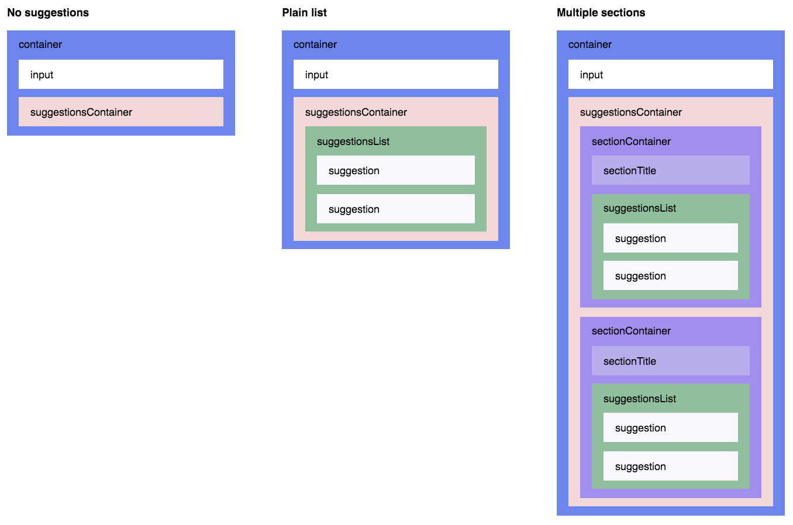

[](https://codeship.com/projects/67868)
[](https://github.com/moroshko/react-autosuggest/graphs/contributors)
[](https://codecov.io/gh/moroshko/react-autosuggest)

[](https://npmjs.org/package/react-autosuggest)
[](https://npmjs.org/package/react-autosuggest)


# React Autosuggest

## Demo

查看[主页](http://react-autosuggest.js.org) 和  [Codepen 示例](http://codepen.io/collection/DkkYaQ)。

## 特性

* [WAI-ARIA compliant](https://rawgit.com/w3c/aria-practices/master/aria-practices-DeletedSectionsArchive.html#autocomplete), 支持ARIA属性和键盘交互
* 对移动端友好
* 很好的插入到 Flux 和 [Redux](http://redux.js.org) 应用程序
* 完全控制[suggestions rendering](#renderSuggestionProp)
* Suggestions 可以表示为 [简单的列表](http://codepen.io/moroshko/pen/LGNJMy) 或 [多个部分](http://codepen.io/moroshko/pen/qbRNjV)
* Suggestions 可以[asynchronously](http://codepen.io/moroshko/pen/EPZpev)检索
* 如果你想的话，可以设置列表的[第一个suggestion高亮](#highlightFirstSuggestionProp)
* 支持样式使用 [CSS Modules](https://github.com/css-modules/css-modules), [Radium](https://github.com/FormidableLabs/radium), [Aphrodite](https://github.com/Khan/aphrodite), [JSS](https://github.com/cssinjs/jss), [和更多](#themeProp)
* 你决定 [什么时候显示suggestions](#shouldRenderSuggestionsProp) (比如. 当用户输入2个或多个字符时)
* [总是渲染 suggestions](#alwaysRenderSuggestionsProp) (适用于移动端和模态框)
* [将任意的属性传递给输入框](#inputPropsProp) (例如. placeholder, type, [onChange](#inputPropsOnChange), [onBlur](#inputPropsOnBlur), 或者 任何其他), 或者 [对输入的渲染进行完全控制](#renderInputComponentProp) (用于与其他库的集成)
* 全面测试

## 安装

```shell
yarn add react-autosuggest
```

或者

```shell
npm install react-autosuggest --save
```

您还可以使用独立的UMD构建：

```html
<script src="https://unpkg.com/react-autosuggest/dist/standalone/autosuggest.js"></script>
```

## 基础用法

```js
import Autosuggest from 'react-autosuggest';

// 假设你有一个你想要自动推荐的语言列表。
const languages = [
  {
    name: 'C',
    year: 1972
  },
  {
    name: 'Elm',
    year: 2012
  },
  ...
];

// 教Autosuggest如何计算给定输入值的建议。
const getSuggestions = value => {
  const inputValue = value.trim().toLowerCase();
  const inputLength = inputValue.length;

  return inputLength === 0 ? [] : languages.filter(lang =>
    lang.name.toLowerCase().slice(0, inputLength) === inputValue
  );
};

// 当suggestion被点击的时候, Autosuggest 基于点击的suggestion来填充输入
//教Autosuggest如何计算每个给定的输入值suggestion.
const getSuggestionValue = suggestion => suggestion.name;

// 运用你的想象力（imagination）来渲染建议。
const renderSuggestion = suggestion => (
  <div>
    {suggestion.name}
  </div>
);

class Example extends React.Component {
  constructor() {
    super();

    // Autosuggest 是一个受控组件.
    // 这意味着你需要提供一个输入值和onChange事件处理方法来更新这个值。
    // Suggestions也需要被提供给Autosuggest，他们的初始都为空，因为Autosuggest是关闭的
    this.state = {
      value: '',
      suggestions: []
    };
  }

  onChange = (event, { newValue }) => {
    this.setState({
      value: newValue
    });
  };

  // 每次你需要更新建议的时候Autosuggest将调用这个函数
  // 上面你已经实现了它的逻辑，所以只管使用它便是
  onSuggestionsFetchRequested = ({ value }) => {
    this.setState({
      suggestions: getSuggestions(value)
    });
  };

  // 每次你需要清除建议的时候Autosuggest将调用这个函数
  onSuggestionsClearRequested = () => {
    this.setState({
      suggestions: []
    });
  };

  render() {
    const { value, suggestions } = this.state;

    // Autosuggest将传递这些props到输入框
    const inputProps = {
      placeholder: 'Type a programming language',
      value,
      onChange: this.onChange
    };

    // 最后, 渲染它!
    return (
      <Autosuggest
        suggestions={suggestions}
        onSuggestionsFetchRequested={this.onSuggestionsFetchRequested}
        onSuggestionsClearRequested={this.onSuggestionsClearRequested}
        getSuggestionValue={getSuggestionValue}
        renderSuggestion={renderSuggestion}
        inputProps={inputProps}
      />
    );
  }
}
```

## Props

| Prop | Type | Required | Description |
| :--- | :--- | :---: | :--- |
| [`suggestions`](#suggestionsProp) | Array | ✓ | 将被显示出来的建议。建议项可以是任意形式。 |
| [`onSuggestionsFetchRequested`](#onSuggestionsFetchRequestedProp) | Function | ✓ | 每次需要重新计算`suggestions`时都会被调用. |
| [`onSuggestionsClearRequested`](#onSuggestionsClearRequestedProp) | Function | ✓[*](#onSuggestionsClearRequestedPropNote) | 每次你需要设置 `suggestions` 为 `[]`时被调用. |
| [`getSuggestionValue`](#getSuggestionValueProp) | Function | ✓ | 实现它来告诉Autosuggest当建议被点击时什么将是输入框的值|
| [`renderSuggestion`](#renderSuggestionProp) | Function | ✓ | 用你的想象力来定义建议如何被渲染 |
| [`inputProps`](#inputPropsProp) | Object | ✓ |  传递任意的props到输入框。它至少包含 `value` 和 `onChange`. |
| [`onSuggestionSelected`](#onSuggestionSelectedProp) | Function | | 每次建议通过鼠标或键盘被选择的时候将被调用|
| [`onSuggestionHighlighted`](#onSuggestionHighlightedProp) | Function | | 每次高亮显示的建议改变的时候被调用 |
| [`shouldRenderSuggestions`](#shouldRenderSuggestionsProp) | Function | | 当输入框获得焦点，Autosuggest将咨询此函数，什么时候渲染建议。使用它，例如，当当输入值至少是2个字符长时，如果你想要显示建议 |
| [`alwaysRenderSuggestions`](#alwaysRenderSuggestionsProp) | Boolean | | 如果你想要在输入框未获得焦点时渲染建议，可将它设置为`true` |
| [`highlightFirstSuggestion`](#highlightFirstSuggestionProp) | Boolean | | 如果你想要Autosuggest自动高亮显示第一个建议，将它设置为`true` |
| [`focusInputOnSuggestionClick`](#focusInputOnSuggestionClickProp) | Boolean | | 如果你不想Autosuggest在建议被点击/拔出时保持输入框被聚焦，请设置为`false` |
| [`multiSection`](#multiSectionProp) | Boolean | | Set it to `true` if you'd like to display suggestions in multiple sections (with optional titles). 如果你想要在多选框中显示建议（带选项标题），请设置为`true`。|
| [`renderSectionTitle`](#renderSectionTitleProp) | Function | ✓<br>when `multiSection={true}` | 使用你的想象力来定义怎样渲染章节的标题 |
| [`getSectionSuggestions`](#getSectionSuggestionsProp) | Function | ✓<br>when `multiSection={true}` | 实现它来告诉Autosuggest在哪里找到每一节的建议 |
| [`renderInputComponent`](#renderInputComponentProp) | Function | |  如果你需要自定义输入框的渲染结果，使用它|
| [`renderSuggestionsContainer`](#renderSuggestionsContainerProp) | Function | |  如果您想在建议容器内，除了建议本身之外定制一些内容，那么就可以使用它。|
| [`theme`](#themeProp) | Object | | 使用你的想象力来装饰Autosuggest |
| [`id`](#idProp) | String | | 如果你在一个页面有多个Autosuggest，请使用它 |

<a name="suggestionsProp"></a>
#### suggestions (required)

用来显示的建议数组。唯一的要求是，`suggestions`是一个数组。这个数组中的项可以任意形式。

对于一个简单的建议列表，`suggestions`中的每一项都代表一个建议。这取决于你的每一个建议都是什么样子。例如:

```js
const suggestions = [
  {
    text: 'Apple'
  },
  {
    text: 'Banana'
  },
  {
    text: 'Cherry'
  },
  {
    text: 'Grapefruit'
  },
  {
    text: 'Lemon'
  }
];
```

对于 [多章节](#multiSectionProp),`suggestions`的每一项代表一个单一的章节。  同样，这取决于每个章节的形式。例如:

```js
const suggestions = [
  {
    title: 'A',
    suggestions: [
      {
        id: '100',
        text: 'Apple'
      },
      {
        id: '101',
        text: 'Apricot'
      }
    ]
  },
  {
    title: 'B',
    suggestions: [
      {
        id: '102',
        text: 'Banana'
      }
    ]
  },
  {
    title: 'C',
    suggestions: [
      {
        id: '103',
        text: 'Cherry'
      }
    ]
  }
];
```

<a name="onSuggestionsFetchRequestedProp"></a>
#### onSuggestionsFetchRequested (required)

每次你可能需要更新[`suggestions`](#suggestionsProp)的时候这个函数被调用. 它有以下特征:

```js
function onSuggestionsFetchRequested({ value, reason })
```

where:

* `value` - 当前输入框的值
* `reason` - 字符串描述 为什么 `onSuggestionsFetchRequested` 被调用. 可能的值有:
  * `'input-changed'` - 用户输入的东西
  * `'input-focused'` - 输入框获得焦点
  * `'escape-pressed'` - 用户按下 <kbd>Escape</kbd> 来清除输入框(对空输入给出建议)
  * `'suggestions-revealed'` - 用户按下 <kbd>Up</kbd> 或者 <kbd>Down</kbd> 来显示建议
  * `'suggestion-selected'` - 当`alwaysRenderSuggestions={true}`时，用户选中一个建议

<a name="onSuggestionsClearRequestedProp"></a>
#### onSuggestionsClearRequested (required 除非 `alwaysRenderSuggestions={true}`)

你每次需要清除[`suggestions`](#suggestionsProp)时调用此函数

在这个函数中，你要做的就是设置`suggestions`为`[]`。

<a name="onSuggestionsClearRequestedPropNote"></a>
**注意:** 当 `alwaysRenderSuggestions={true}`, 你不需要实现这个函数。

<a name="getSuggestionValueProp"></a>
#### getSuggestionValue (required)

当用户使用<kbd>Up</kbd> 和 <kbd>Down</kbd> 键导航建议时， [应该根据突出显示的建议设置输入框的值](https://rawgit.com/w3c/aria-practices/master/aria-practices-DeletedSectionsArchive.html#autocomplete)。你设计了建议的模型。因此，告诉Autosuggest如何将建议映射到输入框值是你的责任。

这个函数得到了一个有问题的建议，它应该返回一个字符串。例如:

```js
function getSuggestionValue(suggestion) {
  return suggestion.text;
}
```

<a name="renderSuggestionProp"></a>
#### renderSuggestion (required)

Use your imagination to define how suggestions are rendered.利用你的想象力来定义如何渲染建议。

签名为:

```js
function renderSuggestion(suggestion, { query, isHighlighted })
```

where:

* `suggestion` - 用来渲染的建议
* `query` - 用来高亮显示匹配的字符串。作为输入框的用户类型，`query`将等于输入框的值。然后，如果用户使用<kbd>Up</kbd> or <kbd>Down</kbd>来进行交互，[输入框将得到高亮显示的建议的值](https://rawgit.com/w3c/aria-practices/master/aria-practices-DeletedSectionsArchive.html#autocomplete), 但是，`query`的值仍然等于在<kbd>Up</kbd> 和 <kbd>Down</kbd>之前输入框的值。
* `isHighlighted` - 建议是否被高亮显示.

它应该返回一个字符串或 `ReactElement`. 例如:

```js
function renderSuggestion(suggestion) {
  return (
    <span>{suggestion.text}</span>
  );
}
```

**重点:** `renderSuggestion`必须是一个纯函数(我们根据这个假设优化了渲染性能).

<a name="inputPropsProp"></a>
#### inputProps (required)

Autosuggest 是一个[受控组件](https://facebook.github.io/react/docs/forms.html#controlled-components)。因此，您必须向输入框传递至少一个`value` 和一个`onChange`回调。你也可以传递其他的属性。例如:

```js
const inputProps = {
  value,          // 通常来自应用程序state
  onChange,       // 数次输入框的值改变时被调用。
  onBlur,         // 当输入框失去焦点时被用调用。 比如 当用户按下Tab键
  type: 'search',
  placeholder: 'Enter city or postcode'
};
```

<a name="inputPropsOnChange"></a>
##### inputProps.onChange (required)

签名如下:

```js
function onChange(event, { newValue, method })
```

where:

* `newValue` -输入框的新值
* `method` - 改变怎样发生的字符串描述。可能的值有:
  * `'down'` - 用户按下 <kbd>Down</kbd>
  * `'up'` - 用户按下 <kbd>Up</kbd>
  * `'escape'` - 用户按下 <kbd>Escape</kbd>
  * `'enter'` - 用户按下 <kbd>Enter</kbd>
  * `'click'` - 用户在建议上点击 (或者 敲击)
  * `'type'` - 上面的方法都没有 (通常意味着用户输入了一些东西、但也可能是他们按下了空格、将一些东西粘贴到输入中，等等)

<a name="inputPropsOnBlur"></a>
##### inputProps.onBlur (optional)

签名是:

```js
function onBlur(event, { highlightedSuggestion })
```

where:

* `highlightedSuggestion` - 如果没有高亮显示的建议，那么在输入失去焦点或者为`null`之前就会高亮显示的建议。

<a name="onSuggestionSelectedProp"></a>
#### onSuggestionSelected (optional)

当建议被选择时调用。他有如下签名

```js
function onSuggestionSelected(event, { suggestion, suggestionValue, suggestionIndex, sectionIndex, method })
```

where:

* `suggestion` - 选择的建议
* `suggestionValue` - 选择的建议的值(等效于 `getSuggestionValue(suggestion)`)
* `suggestionIndex` - 选择的建议在 `suggestions` 数组中的索引
* `sectionIndex` - 当渲染[多个章节](#multiSectionProp), 这将是选择的建议所在章节在建议数组中（[`suggestions`](#suggestionsProp)）的索引。否则，为`null` 。
* `method` - 用户怎样选择章节的字符串描述。可能的值有:
  * `'click'` - 用户在建议上点击 (或者敲击)
  * `'enter'` - 用户使用<kbd>Enter</kbd>键选择建议

<a name="onSuggestionHighlightedProp"></a>
#### onSuggestionHighlighted (optional)

当高亮显示建议改变时这个函数被调用。下面是它的签名：

```js
function onSuggestionHighlighted({ suggestion })
```

where:
* `suggestion` - 高亮显示的建议，没有高亮显示的建议时为`null`。

<a name="shouldRenderSuggestionsProp"></a>
#### shouldRenderSuggestions (optional)

默认情况下，当输入不是空的时候就会显示建议。请随意覆盖这种行为。

这个函数获得输入的当前值，它应该返回一个布尔值。

例如，仅当输入值至少为3个字符时才显示建议:

```js
function shouldRenderSuggestions(value) {
  return value.trim().length > 2;
}
```

当 `shouldRenderSuggestions` 返回 `true`, **建议只在输入框获得焦点时集中时才

如果您想渲染建议，而不管输入框是否获得焦点，那么设置`alwaysRenderSuggestions={true}`(在本例中应该忽略`shouldRenderSuggestions`)。

<a name="alwaysRenderSuggestionsProp"></a>
#### alwaysRenderSuggestions (optional)

Set 如果想要总是渲染建议，设置`alwaysRenderSuggestions={true}`

**重点:** 确保`suggestions`的初始值与`inputProps.value`的初始值相对应。例如，如果您想在输入为空时显示所有的建议，那么您的初始状态应该是这样的:
```js
this.state = {
  value: '',
  suggestions: allSuggestions
};
```

<a name="highlightFirstSuggestionProp"></a>
#### highlightFirstSuggestion (optional)

当 `highlightFirstSuggestion={true}`, Autosuggest将自动高亮显示第一个建议。默认为 `false`.

<a name="focusInputOnSuggestionClickProp"></a>
#### focusInputOnSuggestionClick (optional)

默认情况下, `focusInputOnSuggestionClick={true}`, 这意味着，每次建议被点击（或者敲击），输入框都会保持聚焦状态。

在移动设备上，当输入框获得焦点时，原生的键盘会出现。为了隐藏键盘，你可能会想要在建议被点击的时候失去焦点。

你需要这样做

```xml
<Autosuggest focusInputOnSuggestionClick={!isMobile} ... />
```

`isMobile`是一个布尔值，描述了Autosuggest是否是在移动设备上运行。 你可以使用[kaimallea/isMobile](https://github.com/kaimallea/isMobile), 举个例子来说。

<a name="multiSectionProp"></a>
#### multiSection (可选的)

在默认情况下，Autosuggest渲染了一个简单的建议列表。

如果你想要有一个多章节的 (可以带title), 请设置 `multiSection={true}`.

<a name="renderSectionTitleProp"></a>
#### renderSectionTitle (required when `multiSection={true}`)

当渲染[multiple sections](#multiSectionProp)时, 你需要告诉Autosuggest怎样渲染一个章节标题。

这个函数获得章节来渲染 ([suggestions](#suggestionsProp) 数组中的一项), 它将返回一个字符串或者一个`ReactElement`. 例如:

```js
function renderSectionTitle(section) {
  return (
    <strong>{section.title}</strong>
  );
}
```

如果 `renderSectionTitle` 返回 `null` 或者 `undefined`, 章节标题不会被渲染

<a name="getSectionSuggestionsProp"></a>
#### getSectionSuggestions (required when `multiSection={true}`)

当渲染[多个章节时](#multiSectionProp), 你需要告诉Autosuggest去哪里找到指定的章节。


这个函数获得章节来渲染 ([suggestions](#suggestionsProp) 数组中的一项),, 它应该返回一个指定章节中用来渲染的建议数组，例如：

```js
function getSectionSuggestions(section) {
  return section.suggestions;
}
```

**注意:** 不带建议的章节不能被渲染。

<a name="renderInputComponentProp"></a>
#### renderInputComponent (可选)

你不需要指定`renderInputComponent`，除非你想要自定义输入框的渲染结果。

为了保持Autosuggest的[可访问性](https://rawgit.com/w3c/aria-practices/master/aria-practices-DeletedSectionsArchive.html#autocomplete), `renderInputComponent` **必须:**

* 渲染一个输入框
* 传递提供的所有`inputProps` 到输入框

Example:

```js
const renderInputComponent = inputProps => (
  <div>
    <input {...inputProps} />
    <div>custom stuff</div>
  </div>
);

```

**注意:** 当使用 `renderInputComponent`, 你仍需要指定平常的 [`inputProps`](#inputPropsProp)。Autosuggest 将合并`inputProps`，那些你提供的可以访问到的props(比如 `'aria-activedescendant'`), 并将传递**合并后的 `inputProps`** 到 `renderInputComponent`.

<a name="renderSuggestionsContainerProp"></a>
#### renderSuggestionsContainer (可选)

你不需要指定`renderSuggestionsContainer`，除非你想要自定义除了提出这些建议本身之外的内容或者建议容器的行为。例如，你可能想要添加一个自定义的文本before/after这个建议列表，或者来[自定义建议容器的滚动行为](https://github.com/moroshko/react-autosuggest/blob/master/FAQ.md#limitSuggestionsContainerScrolling).

签名如下:

```js
function renderSuggestionsContainer({ containerProps, children, query })
```

where:

* `containerProps` - props，你必须传递到从`renderSuggestionsContainer`返回的最顶层元素。
* `children` - 建议本身. 这取决于你在哪里渲染它们。
* `query` - 与[`renderSuggestion`](#renderSuggestionProp)中的`query` 一样

例如：

```js
function renderSuggestionsContainer({ containerProps , children, query }) {
  return (
    <div {... containerProps}>
      {children}
      <div>
        Press Enter to search <strong>{query}</strong>
      </div>
    </div>
  );
}
```

当 `renderSuggestionsContainer` 返回一个复合组件 (例如： `<IsolatedScroll ... />` 反对DOM节点如`<div ... />`),你**必须** 使用复合组件渲染的最顶层元素调用`containerProps.ref` 。

例如：

```js
import IsolatedScroll from 'react-isolated-scroll';

function renderSuggestionsContainer({ containerProps, children }) {
  const { ref, ...restContainerProps } = containerProps;
  const callRef = isolatedScroll => {
    if (isolatedScroll !== null) {
      ref(isolatedScroll.component);
    }
  };

  return (
    <IsolatedScroll ref={callRef} {...restContainerProps}>
      {children}
    </IsolatedScroll>
  );
}
```

<a name="themeProp"></a>
#### theme (可选)

Autosuggest 没有任何样式.

它使用 [react-themeable](https://github.com/markdalgleish/react-themeable)， 允许你使用 [CSS Modules](https://github.com/css-modules/css-modules), [Radium](https://github.com/FormidableLabs/radium), [Aphrodite](https://github.com/Khan/aphrodite), [JSS](https://github.com/cssinjs/jss), [Inline styles](https://facebook.github.io/react/docs/dom-elements.html#style), 和 全局 CSS来为Autosuggest定制样式.

例如, 使用CSS Modules, 这样做:

```css
/* theme.css */

.container { ... }
.input { ... }
.suggestionsContainer { ... }
.suggestion { ... }
.suggestionHighlighted { ... }
...
```

```js
import theme from 'theme.css';
```
```xml
<Autosuggest theme={theme} ... />
```

如果没有指定, `theme` 默认为:

```js
{
  container:                'react-autosuggest__container',
  containerOpen:            'react-autosuggest__container--open',
  input:                    'react-autosuggest__input',
  inputOpen:                'react-autosuggest__input--open',
  inputFocused:             'react-autosuggest__input--focused',
  suggestionsContainer:     'react-autosuggest__suggestions-container',
  suggestionsContainerOpen: 'react-autosuggest__suggestions-container--open',
  suggestionsList:          'react-autosuggest__suggestions-list',
  suggestion:               'react-autosuggest__suggestion',
  suggestionFirst:          'react-autosuggest__suggestion--first',
  suggestionHighlighted:    'react-autosuggest__suggestion--highlighted',
  sectionContainer:         'react-autosuggest__section-container',
  sectionContainerFirst:    'react-autosuggest__section-container--first',
  sectionTitle:             'react-autosuggest__section-title'
}
```

下面的图片说明了`theme`键是如何与Autosuggest的DOM结构相对应的



<a name="idProp"></a>
#### id (必须的，当一个页面上有渲染了多个Autosuggest时它时)

`id`存在的惟一原因是设置ARIA属性(它们需要一个惟一的id)。

当渲染一个单一的,不要设置`id` (默认设置为 `'1'`).

在一个页面上悬案多个Autosuggest组件时，一定要给它们唯一的`id`。例如:

```xml
<Autosuggest id="source" ... />
<Autosuggest id="destination" ... />
```

## 开发

```shell
npm install
npm start
```

现在, 打开 `http://localhost:3000/demo/dist/index.html` ，开干！

## License

[MIT](http://moroshko.mit-license.org)
